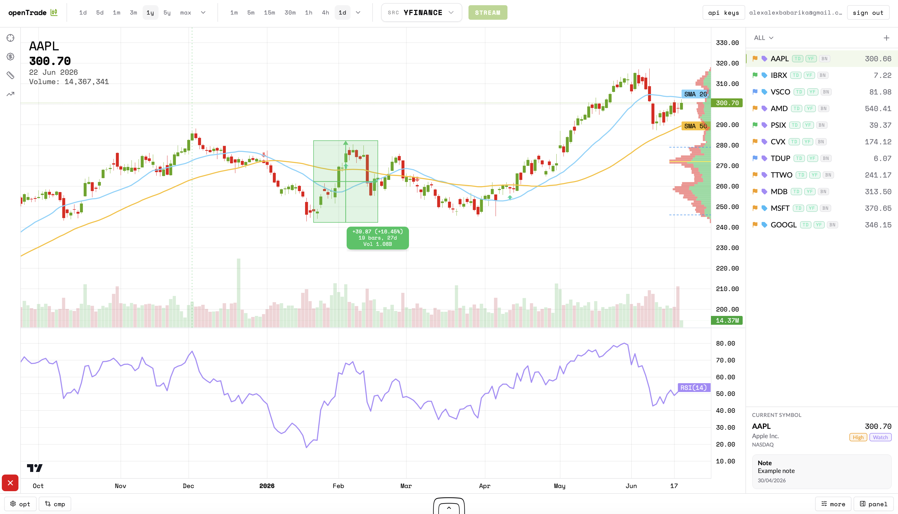
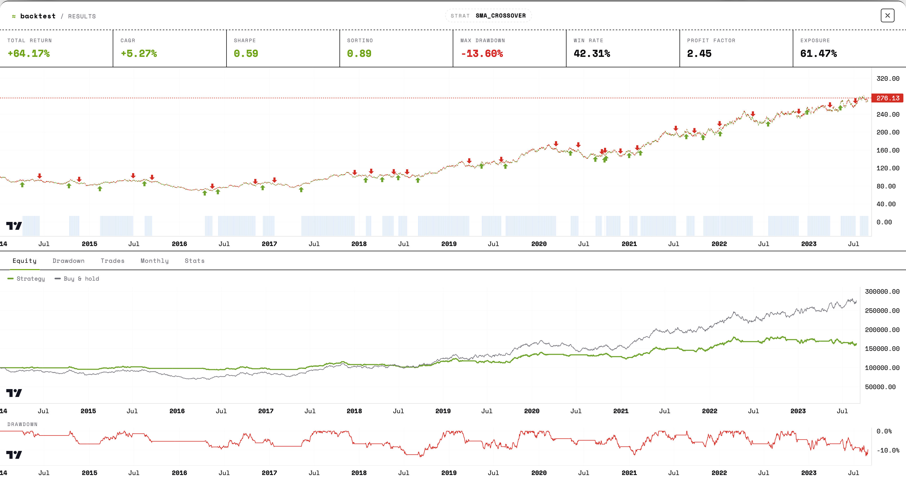
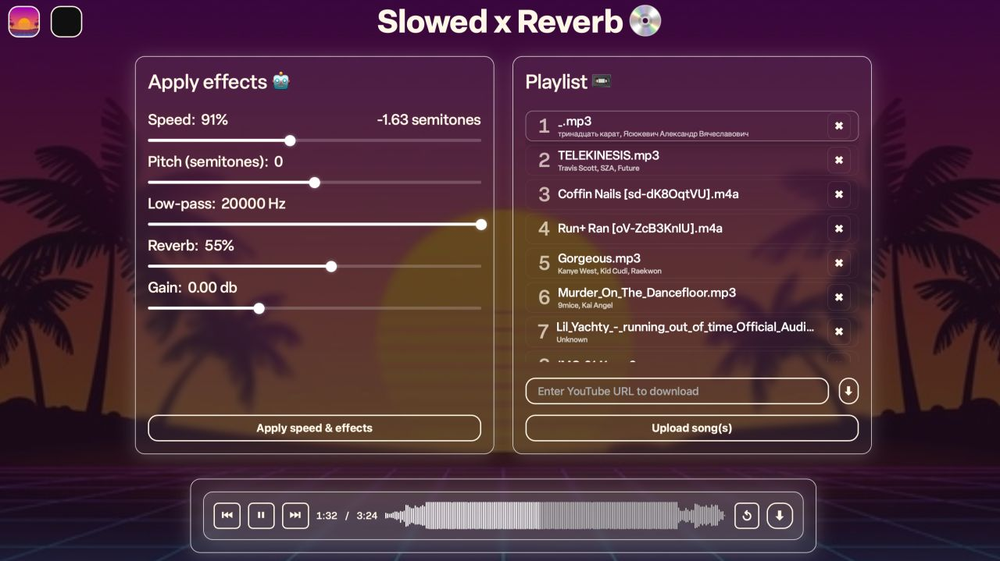
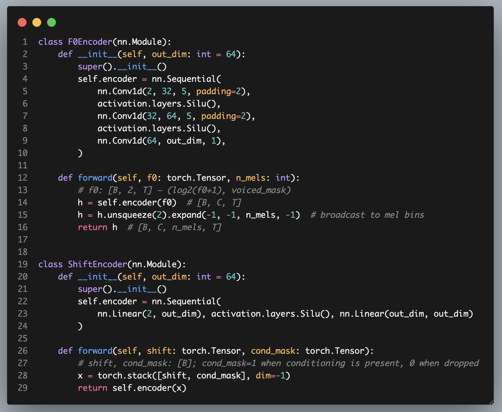
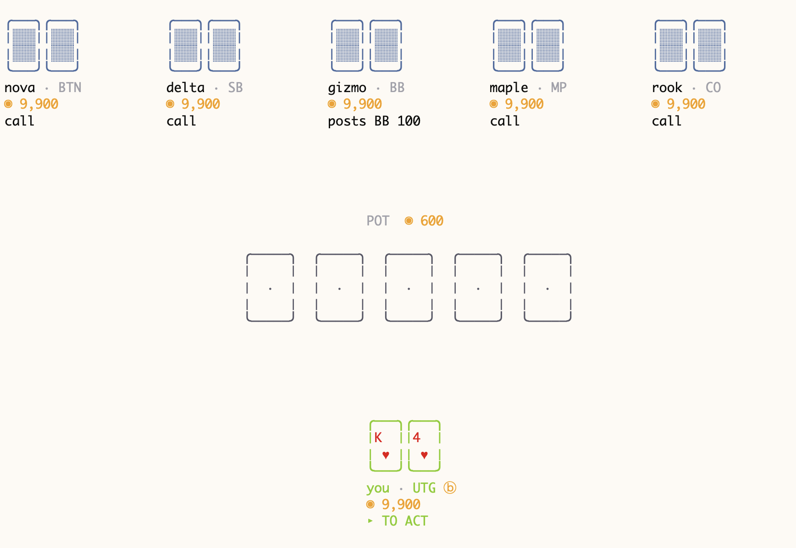

<h1 align="center">Hi, I'm Aleksandr 👋</h1>

  🎓 Computer Science BSc @ King's College London  
  🤖 Deep Learning • Data Science • Applied Maths (ML & Finance)

  
  

---

## 🧠 About Me

- 🎓 2nd year CS student
- 🔬 Interested in **Deep Learning, optimisations, and quantitative modelling**
- 🎸 Exploring **machine learning for audio processing**
- ⚙️ Enjoy low-level systems + high-level ML

---

## 🚀 Featured Projects

  

  

### 📊 OpenTrade

A full-featured web application for **financial instrument analysis and strategy backtesting**.

- ⚙️ Integrated Python-based indicator & backtesting engine
- 📈 Interactive charting with a custom **drawables system**  
- 📐 Tools including long/short positions, AVP, and measurement ruler  
- 🧠 Designed for rapid experimentation with trading strategies  

→ [View on GitHub](https://github.com/AlexAlexBabarika/openTrade)

---

  

### 💿 Slowed x Reverb

A web app for **listineng to slowed & reverved versions of your favourite songs**.

- ⚙️ A full-feautured python-based audio manipulation engine
- 📺 Supports downloads from YouTube

→ [View on GitHub](https://github.com/AlexAlexBabarika/Slowed-Reverb-Site)

--- 

  

### 🎼 Self-Supervised AI Pitch Shifter
A self-supervised Conditional UNet for high-quality audio pitch shifting that preserves formants and content. Trained on speech and music datasets from Hugging Face, the model uses FiLM conditioning, F0-gated skip connections, and pitch perturbation augmentation to escape the DSP quality ceiling.
- 🎚️ Preserves formants and harmonic content during pitch transformation
- 🧠 Uses FiLM conditioning and F0-gated skip connections

→ [View on GitHub](https://github.com/AlexAlexBabarika/SelfSupervised-Pitch-Shifter)

---

  

### ♠️♥️♦️♣️ Poker TUI
A terminal Texas Hold'em game written in Rust. Play heads-up or full-ring against bots in a single binary, or connect to a headless server and play a table over the network
- 🕹️ Play against AI opponents or your friends right in your terminal
- 🤖 One pure, deterministic game engine. The bots don't use a trained neural network - they estimate hand equity with Monte Carlo rollouts and bluff using fold-equity math
- 🌐 Connect to a headless server for multiplayer over the network
- 💻 No graphics engine, no web framework — just Unicode box-drawing characters and ANSI colors

→ [View on GitHub](https://github.com/AlexAlexBabarika/pokertui)

---

## 🛠️ Tech Stack

### 💻 Languages

  
  
  
  
  
  

### ⚙️ Frameworks & Tools

  
  
  
  
  
  
  

---

## 📊 Stats

  
  

